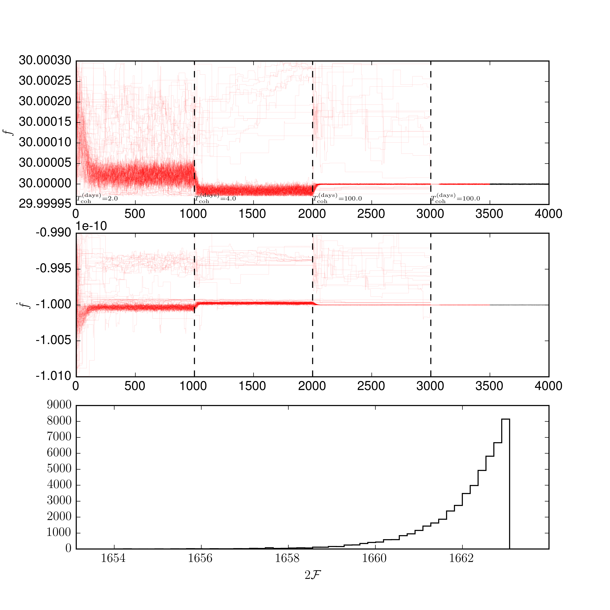

# Semi-coherent Follow-Up MCMC search (dynamically changing the coherence time)

Here, we will show the set-up for using the `MCMCFollowUp` class. The basic
idea is to start the MCMC chains searching on a likelihood with a short coherence
time; once the MCMC chains converge to the solution, the coherence time is
extended effectively narrowing the peak, afterwhich the chains again converge
to this narrower peak. The advantages of such a method are:

1. Dynamically shows the evolution
2. Able to handle multiple peaks and hence can result in a multi-modal posterior
 
The plots here are produced by [follow_up.py](../example/follow_up.py).  We
will run the search on the `basic` data generated in the
[make_fake_data](make_fake_data.md) example. The basic script is here:

```python
import pyfstat

F0 = 30.0
F1 = -1e-10
F2 = 0
Alpha = 5e-3
Delta = 6e-2
tref = 362750407.0

tstart = 1000000000
duration = 100*86400
tend = tstart + duration

theta_prior = {'F0': {'type': 'unif', 'lower': F0*(1-1e-6), 'upper': F0*(1+1e-5)},
               'F1': {'type': 'unif', 'lower': F1*(1+1e-2), 'upper': F1*(1-1e-2)},
               'F2': F2,
               'Alpha': Alpha,
               'Delta': Delta
               }

ntemps = 1
log10temperature_min = -1
nwalkers = 100
run_setup = [(1000, 50), (1000, 25), (1000, 1, False), 
             ((500, 500), 1, True)]

mcmc = pyfstat.MCMCFollowUpSearch(
    label='follow_up', outdir='data',
    sftfilepath='data/*basic*sft', theta_prior=theta_prior, tref=tref,
    minStartTime=tstart, maxStartTime=tend, nwalkers=nwalkers,
    ntemps=ntemps, log10temperature_min=log10temperature_min)
mcmc.run(run_setup)
mcmc.plot_corner(add_prior=True)
mcmc.print_summary()
```

Note that, We use the `MCMCFOllowUpSearch class. Rather than using the `nsteps`
parameter to define how long the chains are run for, this class uses
`run_setup`. This is an `nstage` length list (or array) which determines the
number of steps, how many steps should be considered burn-in, the number of
segments to use, and whether to re-initialise the walkers. Each element of the
list is a 3-tuple of the form `((nburn, nprod), nsegs, resetp0)`. However, each
element can be given as a short form: either ommiting the `nsteps as `(nburn,
nsegs, resetp0)` or omiting the `resetp0` as `((nburn, nsteps), nsegs)`, or
a combination of the two. For example, above we used

```python
run_setup = [(1000, 50), (1000, 25), (1000, 1, False), 
             ((500, 500), 1, True)]
```
Here we run the first two steps with 1000 burn-in steps (such that they will
be discarded) and changing the number of segments, then one 1000 burn-in
steps fully coherently and finally a run with 500 burn-in and 500 production
samples and a reset of the parameters at the begining. The output is
demonstrated here:



Some things to note:
* The `resetp0` is useful to clean-up straggling walkers, but will remove all
multimodality potentially loosing information.
* On the first axis the coherence time is displayed for each section
* In this example the signal is quite strong and in Gaussian noise
* The `twoF` distribution plotted at the bottom is taken only from the production
run
* This plot is generated after each stage of the run - this can be useful to
check it is converging before continuing the simulation


