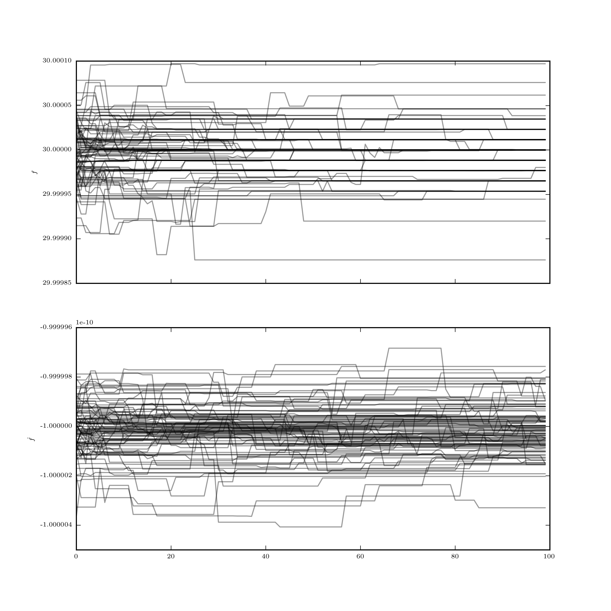
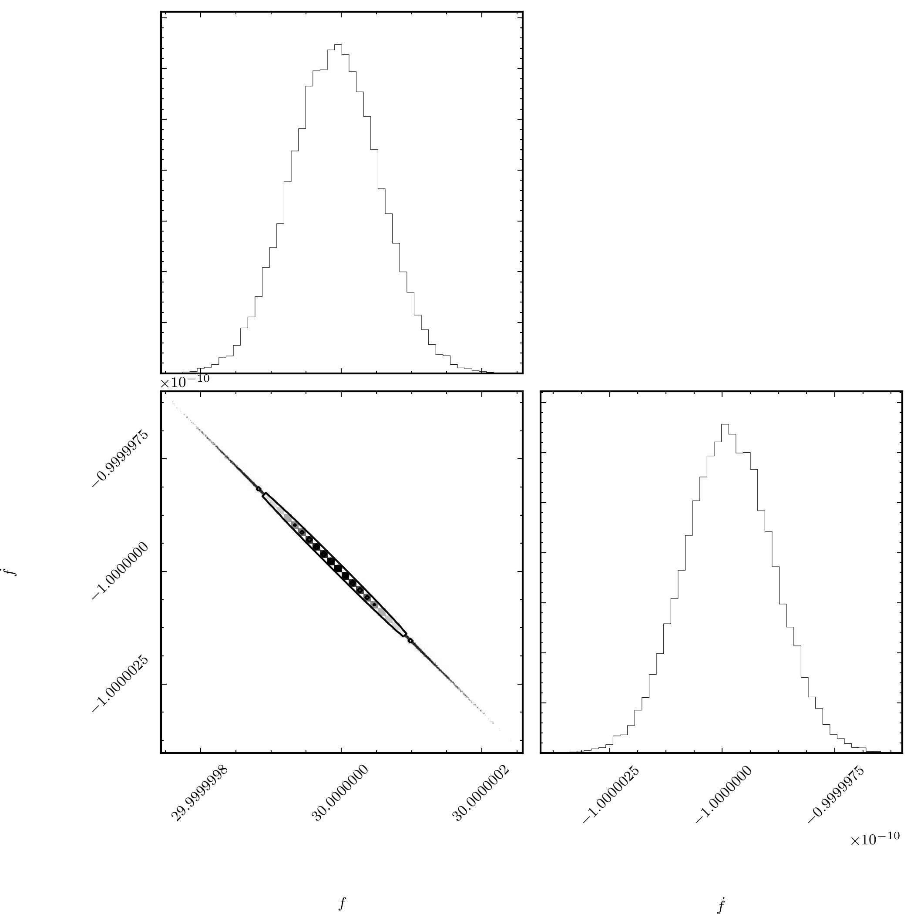

# Fully coherent search using MCMC

In this example, we will show the basics of setting up and running an MCMC
search for a fully-coherent search. This is based on the example
[fully_coherent_search.py](../example/fully_coherent_search.py). We will run
the search on the `basic` data generated in the
[make_fake_data](make_fake_data.md) example.

We first need to import the search tool, in this example we will use the
`MCMCSearch`, but one could equally use `MCMCGlitchSearch` with `nglitch=0`.
We first import this,

```
from pyfstat import MCMCSearch
```

Next, we define some variables defining the center of our search, namely the
Crab parameters (with which the `basic` data was produced):

```
F0 = 30.0
F1 = -1e-10
F2 = 0
Alpha = 5e-3
Delta = 6e-2
tref = 362750407.0

tstart = 1000000000
duration = 100*86400
tend = tstart = duration
```

Next, we specify our prior, this is done using a dictionary:

```
theta_prior = {'F0': {'type': 'norm', 'loc': F0, 'scale': abs(1e-6*F0)},
               'F1': {'type': 'norm', 'loc': F1, 'scale': abs(1e-6*F1)},
               'F2': F2,
               'Alpha': Alpha,
               'Delta': Delta}
```
Each key and value of the `theta_prior` contains an instruction to the MCMC
search. If the value is a scalar, the MCMC search holds these fixed (as is the
case for `F2`, `Alpha`, and `Delta` here). If instead the value is a dictionary
describing a distribution, this is taken as the prior and the variable is
simulated in the MCMC search (as is the case for `F0` and `F1`). Note that
for `MCMCSearch`, `theta_prior` must contain at least all of the variables
given here (even if they are zero), and if `binary=True`, it must also contain
the binary parameters.

Next, we define the parameters of the MCMC search:

```
ntemps = 1
nwalkers = 100
nsteps = [100, 500, 1000]
```

These can be considered the *tuning parameters* of the search. In this instance
we use a single temperature with 100 walkers. For the number of steps we use
a 2-step process. First we run the simulation starting from values picked
about the prior for `100` steps, afterwhich we take the maximum likelihood
chain and pick a new set of walkers scattered about this. This step removes
walkers which get lost is islands of low probability (it can be removed by
simply called `nsteps = [500, 1000]`). Finally, the simulation run for `500`
steps of burn-in then `1000` steps of production to estimate the posterior.

Passing all this to the MCMC search, we also need to give it a label and
directory to save the data and provide `sftlabel` and `sftdir` which defines
which data to use in the search

```
mcmc = MCMCSearch('fully_coherent', 'data', sftlabel='basic', sftdir='data',
                  theta_prior=theta_prior, tref=tref, tstart=tstart, tend=tend,
                  nsteps=nsteps, nwalkers=nwalkers, ntemps=ntemps,
                  scatter_val=1e-10)
```

To run code, we call

```
mcmc.run()
```

This produces two `png` images. The first is the chains after the
initialisation step

Here one can see there are multiple evenly spaced solutions (at least in
frequency) corresponding to different peaks
in the likelihood. Taking the largest peak, the walkers are reinitialised about
this point (scattered in a relative way by the `scatter_val`) and run again
producing

Now once can see that the chains have converged onto the single central peak.

To get posteriors, we call

```
mcmc.plot_corner()
```
which produces a corner plot

illustrating the tightly constrained posteriors on `F0` and `F1` and their
covariance. Furthermore, one may wish to get a summary which can be printed
to the terminal via

```
mcmc.print_summary()
```
which gives the maximum twoF value, median and standard-deviation, in this case
this is
```
Max twoF: 1756.44177246
F0 = 2.999999974e+01 +/- 6.363964377e-08
F1 = -9.999960025e-11 +/- 9.920455272e-17
```
