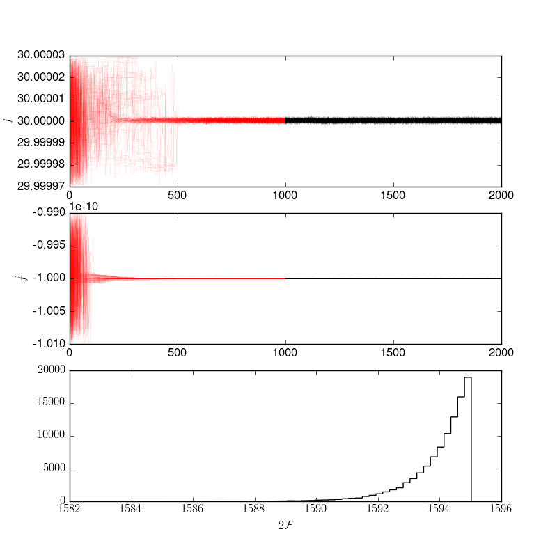
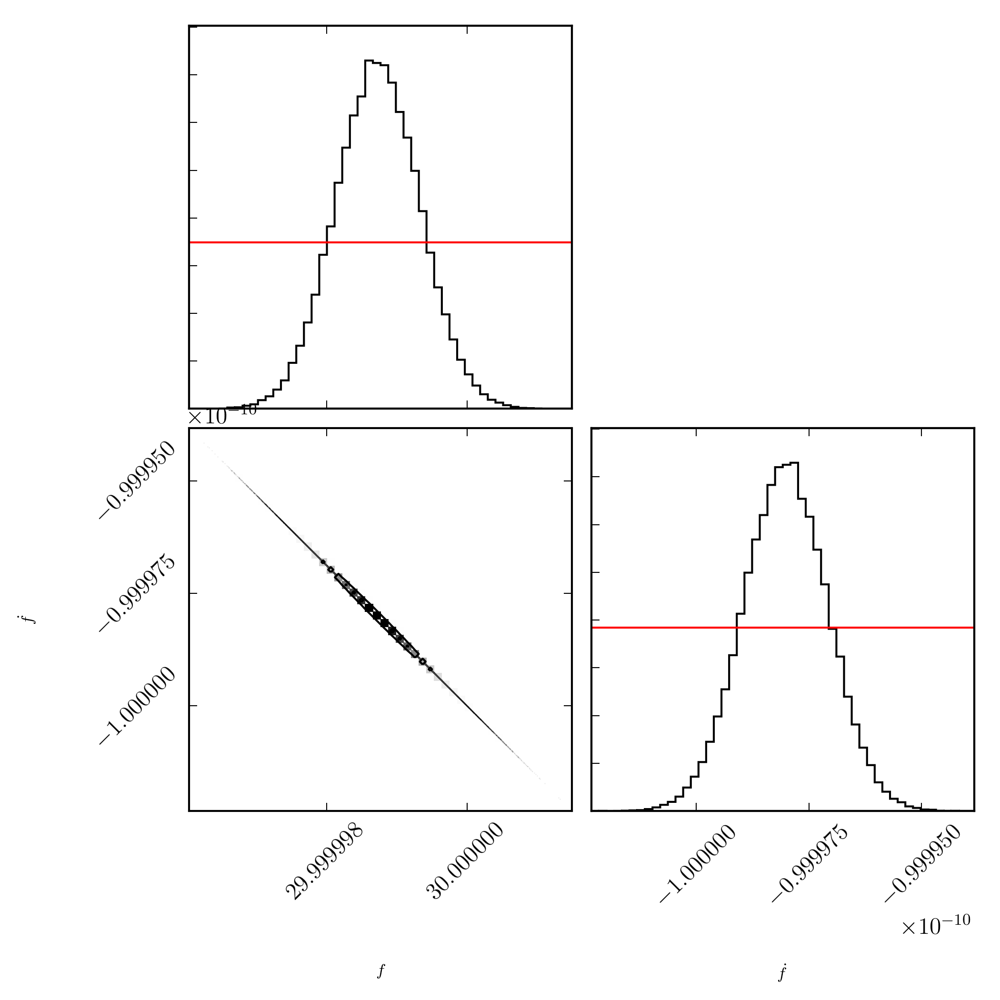

# Fully coherent search using MCMC

In this example, we will show the basics of setting up and running a
fully-coherent MCMC search. This is based on the example
[fully_coherent_search_using_MCMC.py](../example/fully_coherent_search_using_MCMC.py).
We will run the search on the `basic` data generated in the
[make_fake_data](make_fake_data.md) example.

First, we need to import the search tool, in this example we will use the
`MCMCSearch`, but one could equally use `MCMCGlitchSearch` with `nglitch=0`.
To import this,

```python
from pyfstat import MCMCSearch
```

Next, we define some variables defining the exact parameters of the signal
in the data, and the start and end times:

```python
F0 = 30.0
F1 = -1e-10
F2 = 0
Alpha = np.radians(83.6292)
Delta = np.radians(22.0144)
tref = 362750407.0

tstart = 1000000000
duration = 100*86400
tend = tstart = duration
```

Now, we need to specify our prior. This is a dictionary containing keys for
each variable (in the `MCMCSearch` these are `F0`, `F1`, `F2`, `Alpha`, and
`Delta`). In this example, we choose a uniform box in `F0` and `F1`:

```python
theta_prior = {'F0': {'type': 'unif', 'lower': F0*(1-1e-6), 'upper': F0*(1+1e-6)},
               'F1': {'type': 'unif', 'lower': F1*(1+1e-2), 'upper': F1*(1-1e-2)},
               'F2': F2,
               'Alpha': Alpha,
               'Delta': Delta
               }
```
Each key and value of the `theta_prior` contains an instruction to the MCMC
search. If the value is a scalar, the MCMC search holds these fixed (as is the
case for `F2`, `Alpha`, and `Delta` here). If instead the value is a dictionary
describing a distribution, this is taken as the prior and the variable is
simulated in the MCMC search (as is the case for `F0` and `F1`). Note that
for `MCMCSearch`, `theta_prior` must contain at least all of the variables
given here (even if they are zero), and if `binary=True`, it must also contain
the binary parameters.

Next, we define the parameters of the MCMC search:

```python
ntemps = 4
log10temperature_min = -1
nwalkers = 100
nsteps = [1000, 1000]
```

These can be considered the *tuning parameters* of the search. A complete
discussion of these can be found [here](tuning_parameters.md).

Passing all this to the MCMC search, we also need to give it a label, a
directory to save the data, and provide `sftfilepath`, a string matching
the data to use in the search

```python
mcmc = MCMCSearch(label='fully_coherent_search_using_MCMC', outdir='data', 
                  sftfilepath='data/*basic*sft', theta_prior=theta_prior,
                  tref=tref, tstart=tstart, tend=tend, nsteps=nsteps,
                  nwalkers=nwalkers, ntemps=ntemps,
                  log10temperature_min=log10temperature_min)
```

To run the simulation, we call

```python
mcmc.run()
```

This produces two `.png` images. The first is the position of the *walkers*
during the simulation:

This shows (in red) the position of the walkers during the burn-in stage. They
are initially defuse (they start from positions randomly picked from the prior),
but eventually converge to a single stable solution. The black is the production
period from which posterior estimates are made. The bottom panel is a histogram
of `twoF`, split for the production period. Note that, early on there are
multiple modes corresponding to other peaks, by using the parallel tempering,
we allow the walkers to explore all of these peaks and opt for the strong
central candidate.

To get posteriors, we call

```python
mcmc.plot_corner()
```
which produces a corner plot

illustrating the tightly constrained posteriors on `F0` and `F1` and their
covariance. Furthermore, one may wish to get a summary which can be printed
to the terminal via

```python
mcmc.print_summary()
```
which gives the maximum twoF value, median and standard-deviation, in this case
this is
```
Summary:
theta0 index: 0
Max twoF: 1771.50622559 with parameters:
  F0         = 2.999999874e+01
  F1         = -9.999802960e-11

Median +/- std for production values
  F0         = 2.999999873e+01 +/- 6.004803009e-07
  F1         = -9.999801583e-11 +/- 9.359959909e-16
```
