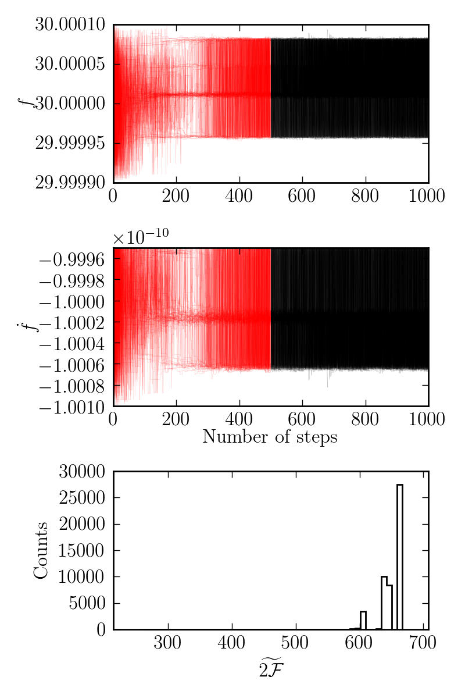
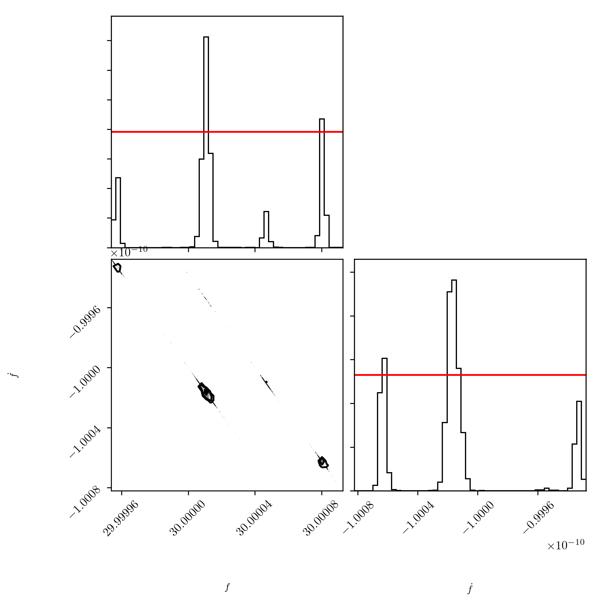

# Fully coherent search on glitching data using MCMC

This example applies the basic [fully coherent
search using MCMC](fully_coherent_search_using_MCMC.md), to the glitching signal data set created in
[make fake data](make_fake_data.md]). The aim here is to illustrate the effect
such a signal can have on a fully-coherent search. The complete script for this
example canbe found
[here](../example/fully_coherent_search_using_MCMC_on_glitching_data.py).


After importing `pyfstat`, We setup a flat prior on `F0` and `F1`, based on the
values used to generate the signal:

```
from pyfstat import MCMCSearch

F0 = 30.0
F1 = -1e-10
F2 = 0
Alpha = 5e-3
Delta = 6e-2
tref = 362750407.0

tstart = 1000000000
duration = 100*86400
tend = tstart + duration

theta_prior = {'F0': {'type': 'unif', 'lower': F0-1e-4, 'upper': F0+1e-4},
               'F1': {'type': 'unif', 'lower': F1*(1+1e-3), 'upper': F1*(1-1e-3)},
               'F2': F2,
               'Alpha': Alpha,
               'Delta': Delta
               }
```

In this search, we will use paralllel tempering (to help the walkers move
between the different peaks in the posterior).
```
ntemps = 2
log10temperature_min = -0.01
nwalkers = 100
nsteps = [5000, 10000]

mcmc = MCMCSearch('fully_coherent_search_using_MCMC_on_glitching_data', 'data',
                  sftfilepath='data/*_glitch*.sft',
                  theta_prior=theta_prior, tref=tref, tstart=tstart, tend=tend,
                  nsteps=nsteps, nwalkers=nwalkers, ntemps=ntemps,
                  log10temperature_min=log10temperature_min)
mcmc.run()
mcmc.plot_corner(add_prior=True)
```

Running this example, we obtain traces of the walkers like this:


Although it is not obvious at first, the large widths of these traces in fact
show that the walkers are jumping between two bimodal peaks (for both `F0` and
`F1): this is possible due to the tuning of the parallel tempering. To see this
clearly, we also plot the corner plot:


From this corner plot, we that unlike the in the [single glitch fully-coherent
search](full_coherent_search_using_MCMC.md), the posterior, even after a large
number of steps, is multimodal. However, these two peaks do **not** correspond
exactly to the two frequencies before and after the glitch, which would be
`30` and `30+4e5` (to see this, see how the data is
[generated](../examples/make_dake_data.py)). This is partly due to the noise
and partly due to the fact that the maximum detection statistic in the case
of glitches can occur at point *in between* the two frequencies. Moreover, we
see bimodality in `F1`, which did does not change during the glitch.

```
>>> mcmc.print_summary()
Max twoF: 1354.7
```
That is, compared to the basic search (on a smooth signal) which had a twoF of
`~1764` (in agreement with the predicted twoF), we have lost a large
fraction of the SNR due to the glitch.

