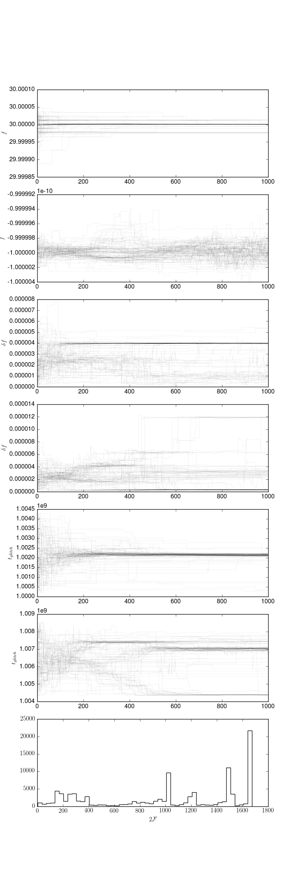
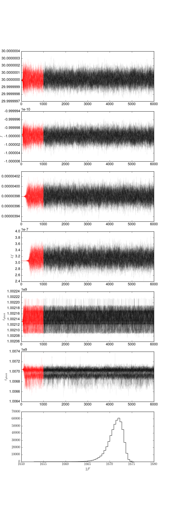
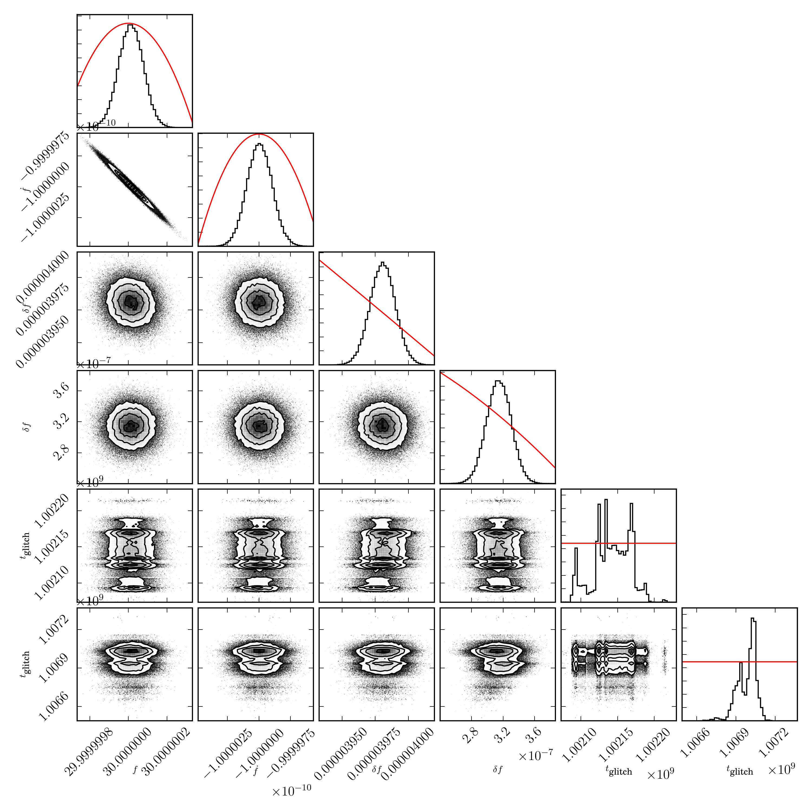

# Semi-coherent glitch search on data with two-glitches using MCMC

In this example, based on [this
script](../examples/semi_coherent_twoglitch_search_using_MCMC.py), we show the
basic setup for a two-glitch search. We begin by defining the prior:

```python
import pyfstat

F0 = 30.0
F1 = -1e-10
F2 = 0
Alpha = 5e-3
Delta = 6e-2
tref = 362750407.0

tstart = 1000000000
duration = 100*86400
tend = tstart + duration

theta_prior = {'F0': {'type': 'norm', 'loc': F0, 'scale': abs(1e-6*F0)},
               'F1': {'type': 'norm', 'loc': F1, 'scale': abs(1e-6*F1)},
               'F2': F2,
               'Alpha': Alpha,
               'Delta': Delta,
               'delta_F0_0': {'type': 'halfnorm', 'loc': 0,
                              'scale': 1e-7*F0},
               'delta_F0_1': {'type': 'halfnorm', 'loc': 0,
                              'scale': 1e-7*F0},
               'delta_F1_0': 0,
               'delta_F1_1': 0,
               'tglitch_0': {'type': 'unif',
                             'lower': tstart+0.01*duration,
                             'upper': tstart+0.5*duration},
               'tglitch_1': {'type': 'unif',
                             'lower': tstart+0.5*duration,
                             'upper': tstart+0.99*duration},
               }

```

Note that, in this case, we define a prior for each of the two glitches.
Alternatively, one can provide a prior (with no indexing) which is applied to
all glitches. The sampler has a prior specification to sort the glitches such
that `tglitch_0 < tglitch_1 < ...`.

The outputs plots:




